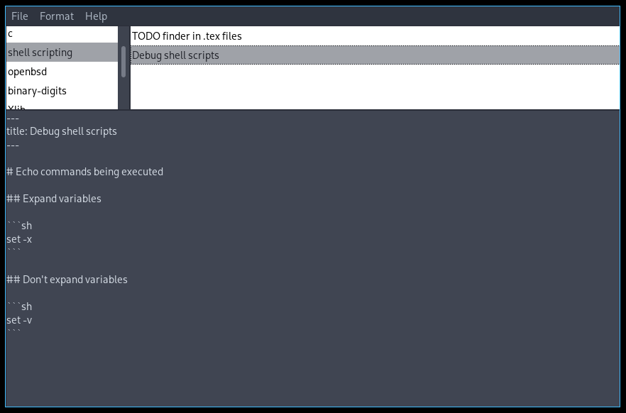

# spnotes-gui

A fully functional proof-of-concept gui program made using
[spnotes](https://github.com/mrsafalpiya/spnotes).

## Preview



## Dependencies

- A C99-compliant compiler.
- [IUP](https://www.tecgraf.puc-rio.br/iup/)

## Building

Simply run

```sh
make release
```
to compile the program and

```sh
make install
```
(requires root privilege) to install the program to the system.
